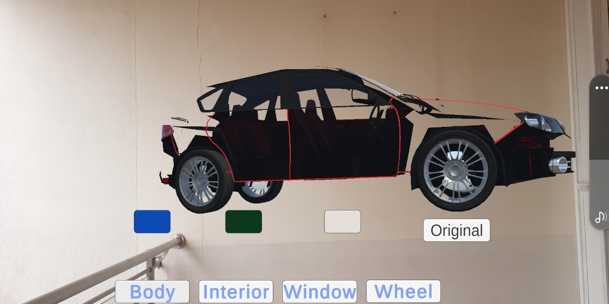

# Augmented Car Showcase Website

## Abstract

The fast-evolving automotive industry faces a crucial need for a more immersive showroom experience to meet proceeding technology and customer expectations. Traditional showrooms, though informative, are falling short. They lack engagement and personalization, limiting buyers to physical viewings, hindering accessibility, and often providing inconsistent information through reliance on sales representatives. The augmented car showcase project represents a cutting-edge solution that seeks to redefine the manner in which consumers engage with and gain insights into automobiles. This project strives to deliver a dynamic and interactive car-buying encounter, one that empowers consumers with profound insights into product details. AR enables users to seamlessly view and virtually engage with car models within the context of their physical surroundings. This ensures more engaging and informative car shopping experience. AR provides comprehensive information about cars specifications, technologies, safety features and pricing aiding users in making informed decisions. Its potential to disrupt and modernize the traditional automotive retail marks it as a promising and impactful development in consumer commerce. The Augmented Car Showcase project does not solely serve consumers; it also represents a transformative sales and marketing tool for automobile manufacturers and dealerships alike. By optimizing the efficiency of the sales process, reducing the necessity for extensive physical inventory, and unlocking fresh avenues for inventive marketing endeavors, this technology offers unprecedented advantages to industry stakeholders.

## Introduction

In the ever-evolving landscape of technology, Augmented Reality (AR) stands as a transformative force, bridging the gap between the digital and physical worlds. AR enriches our perception of reality by overlaying computer-generated information onto our immediate surroundings, enhancing the way we interact with and perceive the world around us. At its core, AR expands the boundaries of our sensory experiences, offering a dynamic blend of virtual and real elements. Unlike Virtual Reality (VR), which immerses users in entirely virtual environments, AR enhances our existing reality by seamlessly integrating digital content into our everyday lives. This integration is often facilitated through devices like smartphones, tablets, smart glasses, and AR-specific hardware.

## Problem Statement

Despite the significant strides made in the automotive sector, the conventional showroom experience remains a bottleneck in the customer's journey towards purchasing a car. Traditional showrooms often fail to captivate customers and fully convey the features, design, and functionality of a vehicle. Potential buyers are left with limited perspectives, relying on brochures, static displays, and verbal explanations from sales representatives. This inadequacy results in a gap between customer expectations and the information they receive, leading to a suboptimal decision-making process. The Augmented Car Showcase website aims to bridge this gap by leveraging AR technology to offer a more immersive and informative car-buying experience.

## Features

- **Virtual Showroom**: Experience a virtual showcase of cars in an immersive AR environment.
- **Customization Options**: Customize car models virtually with different colors, features, and options.
- **Interactive Features**: Engage with virtual car models to explore specifications, technologies, safety features, and pricing.
- **Real-Time Updates**: Stay informed with real-time notifications about new car releases, financing options, and showroom updates.
- **User-Friendly Interface**: Easy navigation and user-friendly design to enhance the user experience.
- **Augmented Reality Integration**: Seamlessly integrate AR capabilities into the car-buying journey.

## Installation

1. Clone the repository:

   ```bash
   $ git clone https://github.com/Mariyammathul-Samla/Augmented-Car-Showcase.git
   ```

2. Navigate into the project directory:

   ```bash
   $ cd Augmented-Car-Showcase
   ```

3. Open the `index.html` file in your web browser.

## Usage

1. Navigate through the virtual car using touch gestures.
2. Click on different car models to view details.
3. Customize cars with different colors and features.
4. Schedule test drives and explore financing options.
5. Enjoy an immersive car-buying experience from the comfort of your home.

## Technologies Used

- HTML5, CSS3, JavaScript
- ARframework for 3D rendering
- AR.js for Augmented Reality integration
- Git for version control
- GitHub for repository hosting


## Screenshots



